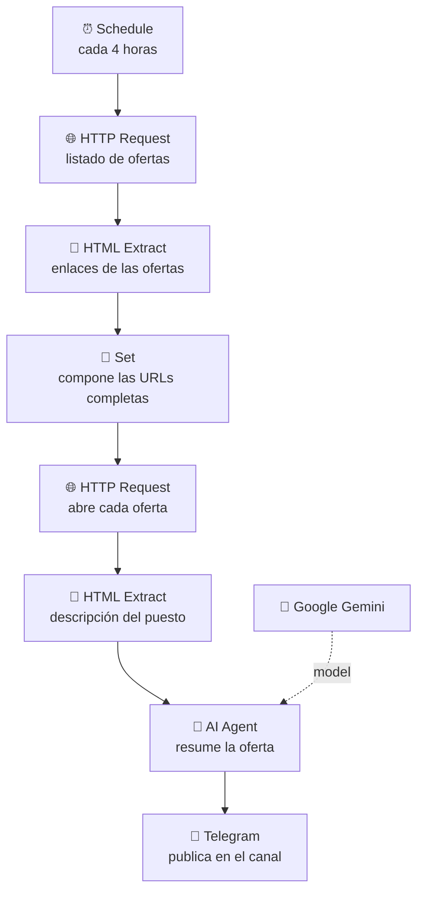

<h1 align="center">Bot de ofertas de IA para Telegram</h1>

<p align="center">
  <b>Rastrea ofertas de empleo de IA/ML, las resume con un LLM y las publica en un canal de Telegram</b><br>
  <i>Cada cuatro horas, sin abrir LinkedIn.</i>
</p>

<p align="center">
  
  
  
</p>

---

## El problema

Buscar trabajo en IA significa revisar el mismo listado varias veces al día, abrir cada oferta y leer tres párrafos de relleno corporativo para descubrir en la última línea que piden cinco años de experiencia en algo que existe desde hace dos.

## La solución

Un bot que hace esa ronda por ti y te deja en Telegram solo lo esencial:

1. Cada **4 horas** se dispara el schedule.
2. Descarga el listado de ofertas y **extrae los enlaces** con selectores HTML.
3. Entra en **cada oferta** y extrae la descripción completa.
4. Un **agente de IA la resume** en un párrafo claro y corto.
5. Publica el resumen y el enlace en el **canal de Telegram**.

El resultado es un canal donde cada mensaje es una oferta ya digerida: qué piden, dónde, y el enlace para aplicar.

## Cómo funciona



## Stack

| Capa | Herramienta |
|---|---|
| Orquestación | n8n (schedule trigger, HTTP, HTML Extract, Set) |
| IA | Google Gemini vía AI Agent de LangChain · OpenAI como alternativa |
| Distribución | Telegram Bot API (canal público) |

## Contenido

```
.
├── job_alerts_bot.json              # El workflow principal
├── telegram_connection_test.json    # Prueba mínima de conexión del bot (2 nodos)
└── README.md
```

`telegram_connection_test.json` es el "hola mundo" que usé para validar el token del bot antes de montar nada más. Se incluye porque es el primer paso obligatorio de cualquier integración con Telegram y ahorra media hora de depuración a quien empiece.

## Reproducirlo

1. Importa `job_alerts_bot.json` en n8n.
2. Crea un bot con [@BotFather](https://t.me/BotFather) y añádelo como administrador de tu canal.
3. Sustituye el `chatId` por el de tu canal y reconecta las credenciales de Telegram y del modelo.
4. Ajusta la URL de búsqueda y los selectores de HTML Extract al sitio que quieras rastrear.

> El export está **sanitizado**: sin tokens ni chat IDs privados.

## Limitaciones conocidas

- **El scraping de LinkedIn es frágil por diseño**: el HTML cambia y el sitio aplica bloqueos. Para algo estable conviene una fuente con API o RSS (Remotive, GetOnBrd, We Work Remotely).
- **No hay deduplicación**: si una oferta sigue en el listado, se vuelve a publicar en la siguiente ejecución. La solución es guardar los enlaces ya enviados —como hace mi [VolunteerAI bot](https://github.com/thaisbrandao/volunteer-ai-bot)— y filtrar contra esa lista.
- **Sin filtro por perfil**: publica todo lo que encuentra. El paso natural es puntuar cada oferta contra un perfil y publicar solo por encima de cierto umbral.

## Autora

**Thaís Brandão** — Data Analyst & AI Strategist
[LinkedIn](https://www.linkedin.com/in/thaisbrand%C3%A3o/) · [GitHub](https://github.com/thaisbrandao)
# ai-job-alerts-bot
Bot en n8n que rastrea ofertas de empleo de IA/ML cada 4 horas, las resume con un LLM y las publica en un canal de Telegram.
