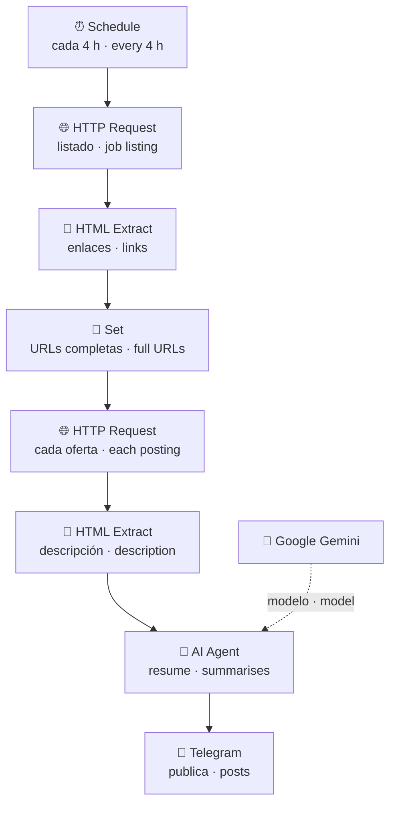

<h1 align="center">Bot de ofertas de IA para Telegram</h1>
<h3 align="center">AI job alerts bot for Telegram</h3>

<p align="center">
  <b>Rastrea ofertas de empleo de IA/ML, las resume con un LLM y las publica en un canal de Telegram.</b><br>
  <sub><i>It scrapes AI/ML job postings, summarises them with an LLM and posts them to a Telegram channel.</i></sub>
</p>

<p align="center">
  
  
  
</p>

> 🇪🇸 **Español** primero, 🇬🇧 **English** debajo en gris. La versión de referencia es la española.<br>
> <sub><i>Spanish first, English underneath in grey. The Spanish version is the reference one.</i></sub>

---

## 🎯 El problema · The problem

Buscar trabajo en IA significa revisar el mismo listado varias veces al día, abrir cada oferta y leer tres párrafos de relleno corporativo para descubrir en la última línea que piden cinco años de experiencia en algo que existe desde hace dos.

<sub><i>Looking for an AI job means checking the same listing several times a day, opening every posting and reading three paragraphs of corporate filler only to find, in the last line, that they want five years of experience in something that has existed for two.</i></sub>

## 💡 La solución · The solution

Un bot que hace esa ronda por ti y te deja en Telegram solo lo esencial:

<sub><i>A bot that does that round for you and leaves only the essentials in Telegram:</i></sub>

1. Cada **4 horas** se dispara el schedule. · <sub><i>The schedule fires every 4 hours.</i></sub>
2. Descarga el listado y **extrae los enlaces** con selectores HTML. · <sub><i>It downloads the listing and extracts the links with HTML selectors.</i></sub>
3. Entra en **cada oferta** y extrae la descripción completa. · <sub><i>It opens each posting and extracts the full description.</i></sub>
4. Un **agente de IA la resume** en un párrafo claro y corto. · <sub><i>An AI agent summarises it into one short, clear paragraph.</i></sub>
5. Publica el resumen y el enlace en el **canal de Telegram**. · <sub><i>It posts the summary and the link to the Telegram channel.</i></sub>

## ⚙️ Cómo funciona · How it works



## 🧰 Stack

| Capa · Layer | Herramienta · Tool |
|---|---|
| Orquestación · Orchestration | n8n (schedule trigger, HTTP, HTML Extract, Set) |
| IA · AI | Google Gemini vía AI Agent de LangChain · OpenAI como alternativa |
| Distribución · Delivery | Telegram Bot API (canal público · public channel) |

## 📂 Contenido · What's inside

```
.
├── job_alerts_bot.json              # Workflow principal · Main workflow
├── telegram_connection_test.json    # Prueba de conexión · Connection test (2 nodes)
└── README.md
```

`telegram_connection_test.json` es el "hola mundo" que usé para validar el token del bot antes de montar nada más.

<sub><i>`telegram_connection_test.json` is the "hello world" I used to validate the bot token before building anything else. It is the mandatory first step of any Telegram integration and saves half an hour of debugging.</i></sub>

## 🚀 Reproducirlo · Run it yourself

1. Importa `job_alerts_bot.json` en n8n. · <sub><i>Import `job_alerts_bot.json` into n8n.</i></sub>
2. Crea un bot con [@BotFather](https://t.me/BotFather) y hazlo administrador de tu canal. · <sub><i>Create a bot with @BotFather and make it an admin of your channel.</i></sub>
3. Cambia el `chatId` y reconecta las credenciales de Telegram y del modelo. · <sub><i>Change the `chatId` and reconnect the Telegram and model credentials.</i></sub>
4. Ajusta la URL de búsqueda y los selectores de HTML Extract. · <sub><i>Adjust the search URL and the HTML Extract selectors.</i></sub>

> El export está **sanitizado**: sin tokens ni chat IDs privados.<br>
> <sub><i>The export is sanitised: no tokens, no private chat IDs.</i></sub>

## ⚠️ Limitaciones conocidas · Known limitations

- **El scraping de LinkedIn es frágil por diseño**: el HTML cambia y el sitio aplica bloqueos. Una fuente con API o RSS (Remotive, GetOnBrd) sería estable.<br><sub><i>Scraping LinkedIn is fragile by design: the HTML changes and the site blocks bots. An API or RSS source would be stable.</i></sub>
- **No hay deduplicación**: si una oferta sigue en el listado, se republica. La solución es guardar los enlaces enviados, como hace mi [VolunteerAI bot](https://github.com/thaisbrandao/volunteer-ai-bot).<br><sub><i>No deduplication: a posting still in the listing gets published again. The fix is storing sent links, as my VolunteerAI bot does.</i></sub>
- **Sin filtro por perfil**: publica todo. El paso natural es puntuar cada oferta contra un perfil y publicar solo por encima de un umbral.<br><sub><i>No profile filter: it posts everything. The natural next step is scoring each posting against a profile and only posting above a threshold.</i></sub>

## 👩🏽‍💻 Autora · Author

**Thaís Brandão** — Data Analyst &amp; AI Strategist
[LinkedIn](https://www.linkedin.com/in/thaisbrand%C3%A3o/) · [GitHub](https://github.com/thaisbrandao)
